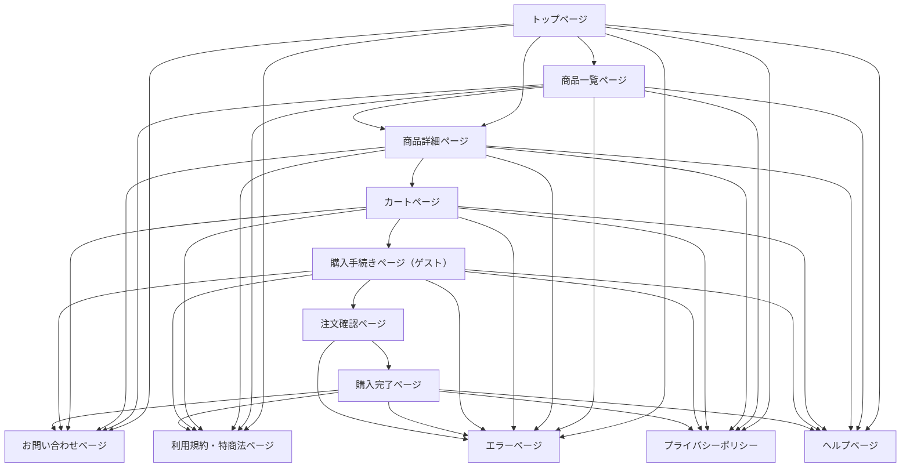

チームF
# 画面一覧（基本設計用）
- F01 トップページ
- F02 商品一覧ページ
- F03 商品詳細ページ
- F04 カートページ
- F05 購入手続きページ（ゲスト）
- F06 購入完了ページ
- F07 お問い合わせページ
- F08 利用規約・特商法ページ
- F09 プライバシーポリシー
- F10 エラーページ
- F11 注文確認画面
- F12 ヘルプページ
- F11 注文確認画面 - F12 ヘルプページ
- 
- 
- 
# 画面遷移図
